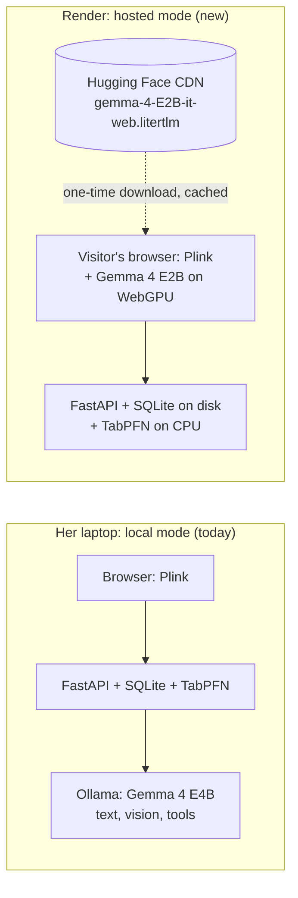

# Plan: Plink on Render, with Gemma in the browser (LiteRT-LM on WebGPU)

**Status: planned, not started.** Written Fri 2 Oct 2026. Four decisions (section 5) must be made before any code is written.

## 1. Goal

Make Plink usable by anyone with a link, not only on the one laptop it was built for:

- deploy the app on **Render**;
- run **Gemma in each visitor's own browser** (LiteRT-LM model on WebGPU) instead of a local Ollama server, so no GPU server is needed and prompts never leave the visitor's device.

Side benefit: a meaningful Render deployment also qualifies the entry for **Best Use of Render**, a $200 featured category in the challenge.

## 2. What was verified (2 Oct 2026)

| Fact | Evidence |
| --- | --- |
| Gemma 4 has LiteRT-LM builds for the web, and they are **not gated** (Apache 2.0) | Hugging Face API: `litert-community/gemma-4-E2B-it-litert-lm` and `gemma-4-E4B-it-litert-lm`, `gated=False`, `license: apache-2.0` |
| Web model files | `gemma-4-E2B-it-web.litertlm` **2.01 GB** (also `-web.task` 2.00 GB); `gemma-4-E4B-it-web.litertlm` **2.97 GB** |
| **The web model is text-only** | Model card: "Web on LiteRT-LM uses a specially optimized model for Web … Currently the model is text-only." |
| Web performance (E2B) | Model card: MacBook Pro M4 Max, WebGPU: prefill 4,853 tok/s, decode 73 tok/s, time to first token 1.09 s, ~1.8 GB GPU memory |
| Browser runtime | `@mediapipe/tasks-genai` **0.10.29** (published 2 Oct 2026). Google's own Gemma 4 web demo (HF Space `tylermullen/Gemma4`) ships the same `genai_wasm_internal` WebAssembly. No separate LiteRT-LM web package exists on npm. |
| That route is in maintenance mode | Model card: "Running Gemma 4 E2B on Web with MediaPipe … this route is currently in maintenance mode." |
| API surface | `LlmInference.createFromOptions` / `createFromModelPath`, `generateResponse(s)`, `maxTokens`, `sizeInTokens`, `cancelProcessing`; models load from `modelAssetPath` (URL) or `modelAssetBuffer` (incl. a `ReadableStreamDefaultReader`, for streaming big files). Image and audio inputs exist in the API, but the Gemma 4 web model doesn't support them yet. |
| **No structured output, no tool calling** | `genai.d.ts` has no schema, JSON, grammar or tool APIs (Ollama gives Plink both today). |
| Visitors can download the model straight from Hugging Face | Cross-origin request to the `resolve` URL: `access-control-allow-origin` echoes the origin, then `*` on the CDN; `206` range requests work; `user_id=public`, size 2,008,432,640 bytes. Render pays no bandwidth for the model. |
| TabPFN on a CPU server | Measured locally with `device="cpu"`: fit plus predict of 450 rows on 200 takes **1.1 s**, a warm pick **0.5 s**; **peak memory about 1.7 GB** (1,662 MB on macOS). Weights: about 200 MB, downloaded with `TABPFN_TOKEN`. |

## 3. What this means

1. **The browser can't read song cards.** The web model is text-only, so "Add a song from a photo" (two-pass vision) stays a local-Ollama feature. It's hidden, with an explanation, in browser mode.
2. **Every Gemma job needs a browser-side rewrite** with prompt-based JSON, parsing, validation and a retry, because there is no `format` schema. Ask Plink needs its own tool protocol (section 7.3).
3. **The browser model is smaller**: E2B, where Plink uses E4B locally, so lessons and answers will be weaker. Validation and the fallbacks already cover bad output.
4. **Visitor requirements:**
   - a browser with WebGPU (current Chrome or Edge on desktop; others vary);
   - about 2 GB of GPU memory;
   - a one-time 2 GB download, cached afterwards.

   Phones and older laptops will mostly fall back to the plain, non-Gemma versions.
5. **Render needs a 2 GB instance** for TabPFN. The 512 MB plans (free and Starter) will run out of memory. Check Render's current pricing; Standard (2 GB) was about $25/month. The challenge page offers Render credits at hacktoberfest.com/my.
6. **Data becomes multi-user.** Today one SQLite file holds one child. Public visitors would share it and could delete each other's data, so they need **private sandboxes** (section 7.4).
7. **The privacy story splits.** Her laptop stays fully local. On Render, Gemma still runs on the visitor's device, but the practice log (bar numbers and timings, never audio) is stored on Render. The README, the status chip ("Nothing leaves this laptop") and the post must say so.

## 4. Recommended architecture: hybrid

Keep the laptop exactly as it is, and add a browser engine that is used when there is no local Ollama.



| Job | Laptop (Ollama) | Render (browser WebGPU) |
| --- | --- | --- |
| Song lessons (parts, names, tips) | ✅ as today | ✅ browser, validated by the server |
| Praise lines | ✅ | ✅ |
| Parent note | ✅ | ✅ (the server supplies stats and TabPFN's trickiest jumps) |
| Ask Plink (tools) | ✅ | ✅ JSON action protocol; tools are server endpoints |
| Song from a photo | ✅ | ❌ hidden: the web model is text-only |
| TabPFN (5 decisions) | ✅ on the Mac GPU | ✅ on the Render CPU |
| Basic Pitch, mic detection, synth | ✅ in the browser | ✅ in the browser (Render serves HTTPS, which the mic needs) |

**Engine choice** is automatic: `/api/health` reports `gemma_engine: "ollama" | "browser" | "none"`. If Ollama is reachable, use it; otherwise, if the browser has WebGPU and the visitor agrees to the download, use the browser; otherwise use the plain fallbacks.

**Where the code lives:** move the Gemma *orchestration* (prompts, retries, the Ask Plink loop) into TypeScript behind a `GemmaEngine` interface with two implementations:

- `WebGpuEngine`: `@mediapipe/tasks-genai`;
- `OllamaEngine`: a thin `/api/gemma/generate` proxy to the local Ollama.

The rules stay in Python, as server endpoints, so "code owns the notes" holds in both modes: lesson validation and size repair, card mapping, the Ask Plink tools, and TabPFN. The alternative, keeping the Python orchestration and duplicating it in TypeScript for the browser, is less work up front but leaves two copies of every prompt to keep in step.

## 5. Decisions needed before starting

| # | Decision | Options | Recommendation |
| --- | --- | --- | --- |
| 1 | Approach | **Hybrid** · replace Ollama everywhere · deploy with Gemma fallbacks only | Hybrid: the laptop keeps E4B, vision and full privacy; the site gets in-browser Gemma |
| 2 | Visitor data | **Private sandbox per visitor** · one shared demo child | Private sandboxes: nobody sees or deletes anyone else's data |
| 3 | Render plan | Standard plus a 1 GB disk · Standard without a disk (data resets on deploy) · free (no TabPFN) | Standard plus a disk, if credits cover it |
| 4 | Browser model | **E2B web (2.0 GB)** · E4B web (3.0 GB) | E2B: smaller download, runs on more machines |

## 6. Prerequisites (need the user)

- [ ] The repository pushed to GitHub (Render builds from a repo).
- [ ] A Render account, and credits claimed at hacktoberfest.com/my if available.
- [ ] `TABPFN_TOKEN` added as a Render secret. The TabPFN-3 licence was already accepted on the account. The licence is non-commercial: a free public demo is fine, but say so on the page.
- [ ] Decisions 1–4.

## 7. Implementation plan

Estimates are rough and assume the hybrid approach, sandboxes, and E2B.

### 7.1 Browser Gemma engine (about 0.5 day)

- `frontend/src/gemma/engine.ts`: `GemmaEngine` with `generate(prompt, {maxTokens, temperature})`, `capabilities: {vision, tools}`, and `ready` state.
- `frontend/src/gemma/webgpu.ts`:
  - **Setup:** `FilesetResolver.forGenAiTasks(...)`, then `LlmInference.createFromOptions` with `modelAssetBuffer` from a streamed `fetch` of the Hugging Face URL.
  - **Caching:** cache the file in the Cache API (or OPFS) so it downloads once.
  - **Feedback:** show download progress, and allow cancelling (`cancelProcessing`).
  - **Format:** apply Gemma's chat template (`chat_template.jinja` in the model repo).
- `frontend/src/gemma/ollama.ts`: calls `/api/gemma/generate` (new backend proxy, local mode only).
- Detection: `navigator.gpu` plus an adapter request; a Grown-ups "AI on this device" panel (status, a download button with the size spelled out, remove-from-cache).
- **Done when:** on a WebGPU laptop, the model downloads once, survives a reload from cache, and answers "Say hi" in under 3 s after warm-up. Without WebGPU, the panel explains and the fallbacks are used.

### 7.2 Lessons, praise and parent note in the browser (about 0.5 day)

- **Prompting without schemas** (the browser has no `format`): ask for a single JSON object in a fenced block. Then:
  - parse the first `{…}`;
  - validate it;
  - on failure, retry once with the validation error appended;
  - then fall back as today.
- **The server keeps the rules:**
  - Lessons: `POST /api/songs/{id}/lesson` gains a body `{phrases}` (proposed by the browser). The server runs the existing `validate_lesson` with size repair and stores it, or returns 422 with the reason, which becomes the retry hint.
  - Parent note: `GET /api/sessions/{id}/note-context` returns stats plus TabPFN's trickiest jumps; the browser writes the note; `POST /api/sessions/{id}/parent-note {text}` validates its length and stores it.
  - Praise: generated per session in the browser; the existing `_validate_praise` rules are ported to TypeScript (small and pure).
- Tests: TypeScript for the prompt builders, JSON extraction and the praise filter; pytest for the new endpoint bodies.
- **Done when:** with the browser engine, a new song gets a named lesson, a session ends with a Gemma note, and bad JSON degrades to the fallbacks.

### 7.3 Ask Plink in the browser (about 0.5 day)

- The tools become read-only endpoints: `GET /api/tools/progress`, `/api/tools/songs`, `/api/tools/predict_song?song=`, `/api/tools/help_advice`, `/api/tools/recent_sessions?count=`. They reuse `app/ask.py`'s handlers, including in-code ranking and `null` for levels not yet tried.
- **JSON action protocol:** each turn, the model must output either `{"tool": name, "args": {…}}` or `{"answer": "…"}`. The browser runs the loop: at most 4 rounds, unknown tools and bad JSON go back to the model as errors, and the tool trace shows under each answer, as today.
- Tests: the loop with a scripted fake engine (tool, then answer; bad JSON; round cap; off-topic).
- **Done when:** the four live questions from the earlier milestone ("ready for Jingle Bells?", "what next?", "less help?", "capital of France?") give the same kind of answers with E2B in the browser.

### 7.4 Private sandboxes (about 0.5 day)

- The browser creates a random family ID on first visit (stored locally; Grown-ups → Data can show and reset it) and sends it on every request as `X-Plink-Family`. Local mode uses a fixed `home` family, so nothing changes on the laptop.
- Schema: add `family_id` to `practicesession`, `attempt`, `song` (user-added only; built-ins are shared), `settings` and `instrumentrow`. Write an additive migration like the existing `ADDED_COLUMNS`, and give existing rows `home`.
- Scope every query in `main.py`, `drill.py`, `summary.py`, `ask.py` and `coach.py` by family. Delete-all deletes only that family. The TabPFN and insights caches are keyed by family.
- Abuse limits for a public site: request size caps (already on most endpoints), a per-family rate limit on Gemma proxy and tool calls, and rows capped per family.
- Tests: two families never see each other's sessions, songs, settings or predictions; delete-all is per family.

### 7.5 Render deployment (about 0.5 day)

- **Serve the built frontend from FastAPI** (`StaticFiles` for `frontend/dist`, SPA fallback to `index.html`), so one service serves both on one origin. Today Vite's dev proxy does this.
- `Dockerfile`, multi-stage:
  1. A Node stage runs `pnpm install && pnpm build`.
  2. A `python:3.12-slim` stage runs `uv sync`, with **CPU-only PyTorch wheels** to keep the image small.
  3. It copies `dist/` in and runs `uvicorn app.main:app --host 0.0.0.0 --port $PORT`.
- TabPFN weights download on first boot (with `TABPFN_TOKEN`) into the persistent disk, so restarts don't download them again. The warm-up thread already exists and now runs under the TabPFN lock.
- `render.yaml` (a sketch; check field names against Render's current Blueprint docs):

  ```yaml
  services:
    - type: web
      name: plink
      runtime: docker
      plan: standard            # 2 GB: TabPFN needs ~1.7 GB
      healthCheckPath: /api/health
      envVars:
        - key: TABPFN_TOKEN
          sync: false           # secret, set in the dashboard
        - key: TABPFN_MODEL_VERSION
          value: v3
        - key: GEMMA_ENGINE
          value: browser        # no Ollama on Render
        - key: PLINK_DB
          value: /data/plink.db
      disk:
        name: plink-data
        mountPath: /data
        sizeGB: 1
  ```

- In hosted mode: the status chip says "Gemma runs in your browser · only bar numbers and timings reach the server"; the photo import is hidden; the Calibrate and Mic check tabs stay (the mic works over HTTPS).
- **Done when:** a fresh Render deploy passes the health check; a visitor on a WebGPU laptop can play, get a TabPFN pick, add a song with a Gemma lesson, and ask Plink a question; a second browser sees none of the first one's data.

### 7.6 Verification and docs (about 0.25 day)

- Headless Chrome against the deployed URL. WebGPU in headless Chrome may need flags; the verification must be honest about what ran on a real GPU.
- Browser check: Chrome and Edge on desktop at least; note Safari and Firefox results as found.
- Update README, NOTES.md and the post: the two modes, what runs where, the privacy wording, the model sizes, and the non-commercial TabPFN licence.

**Total: about 2.5–3 days at the estimates above** (the phases add up to 2.75). That is more than the time left before the deadline (5 Oct, 06:59 UTC) once the hand-over and the write-up are counted. If the deadline comes first, the cheapest useful slice is **7.4 + 7.5 with Gemma fallbacks**: Plink and TabPFN on Render, Gemma local-only, about 1 day.

## 8. Risks

| Risk | Mitigation |
| --- | --- |
| The MediaPipe web route is in maintenance mode, and its API may change | Pin `@mediapipe/tasks-genai@0.10.29`; keep everything behind `GemmaEngine` so a dedicated LiteRT-LM web runtime can replace it later |
| E2B output quality (JSON, tool choice) | Server-side validation, one retry with the error, in-code ranking for Ask Plink, and the existing fallbacks |
| Visitors without WebGPU or with too little GPU memory | Detect early; explain in the panel; the app stays fully usable with fallbacks |
| A 2 GB download on a metered connection | Opt-in only, with the size shown before downloading; never automatic |
| The TabPFN memory and GPU deadlock seen locally | CPU-only on Render; the single TabPFN lock already serialises fit and predict |
| Data on a shared server | Per-visitor sandboxes, no audio ever sent, delete-all per family, a clear privacy note |
| Render cost or limits | Size to Standard; the free tier can't run TabPFN |

## 9. Open questions

- Does the genai WebAssembly need cross-origin isolation (COOP/COEP headers) for threads on Render? To check when building 7.1.
- Exact Gemma 4 chat-template and stop-token handling with `generateResponse` (the model repo ships `chat_template.jinja`).
- How E2B handles the lesson JSON for 40+ note songs. Measure it, as was done for E4B (10–15 s, valid after size repair).
- Whether the challenge judges count a Render deployment with in-browser Gemma as "Best Use of Render" as well as "Best Use of Gemma". Worth one line in the post either way.
