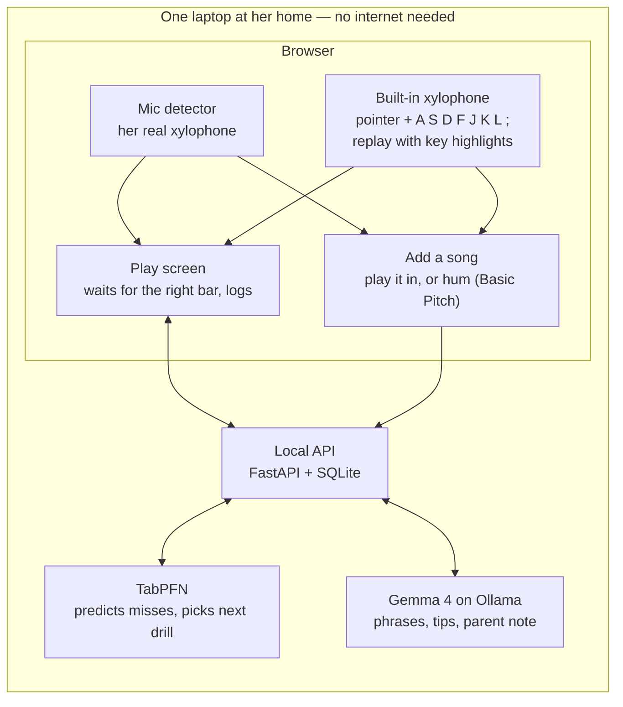

# Plink — a patient xylophone practice partner

> Build spec for the Hacktoberfest 2026 Weekend Challenge, "Build for a Friend".
> Submission due **Monday 5 October 2026, 12:29 PM IST** (06:59 UTC). Target publish time: 11:00 AM IST.

## 1. One-paragraph summary

Plink is a local-first web app built for one child who has just started playing her first instrument, a toy xylophone, and for the parent who sits beside her. It listens through the laptop microphone, learns the sound of *her* bars, shows which bar to hit next, and waits patiently until she finds it. It also has a built-in on-screen xylophone, playable by mouse, touch or the home-row keys, so she can play and practise even without the real instrument. Any tune, phrase or attempt can be replayed on it, with each bar and its key lighting up in time. An open tabular model (TabPFN) studies her practice log and picks the next drill; an open LLM (Gemma, run locally with Ollama) turns any tune into a short lesson and writes a two-line note for the parent. Nothing she plays leaves the laptop, and it works with Wi-Fi off.

## 2. Who it is for

| Person                 | Role in the app                     | What they need                                                                                                        |
| :--------------------- | :---------------------------------- | :-------------------------------------------------------------------------------------------------------------------- |
| The daughter (primary) | Plays                               | Big coloured bars, sound and voice instead of text, no failure buzzer, sessions of about 5 minutes                    |
| The parent (my friend) | Sets up, adds songs, reads progress | One-click start, a way to add "her" songs without reading music, a short plain-language note on what to practise next |

### Assumptions to confirm with the friend before building

- [X] Number of bars and their printed letters or colours. **Confirmed: 8 bars, C major, C to high C.**
- [X] Her age, and whether she can follow a screen. **Confirmed: reads a little; parent sits with her.**
- [ ] Which laptop it runs on and its RAM. **Assumed: 8 GB or more.**
- [ ] Whether I can be in the room on Sunday, or need recordings and a video call.
- [ ] Consent for the post: first name or nickname only, video shows hands and instrument only.

## 3. Challenge constraints (drive every decision below)

- Open-source AI must be what makes the project work.
- Built for exactly one real person; hand it over and report what they said.
- Writing quality is weighted most heavily, so capture evidence while building (section 13).
- The repository must be started and finished inside the challenge window. Any commit after the deadline must be noted in the README.
- Credit all non-trivial open-source work used.
- The built-in player is inspired by my earlier repo `souptik4572/xylophone`. Because submissions must be new projects, it is rebuilt from scratch here: no code or sound files are copied, and the earlier repo is credited in the README and the post.
- Prize categories entered: **Best Use of Gemma**, **Best Use of TabPFN**. Optional: ElevenLabs (demo narration only), Entire (agent-session capture).

## 4. Goals and non-goals

**Goals (v1, this weekend)**

1. Calibrate to her instrument in under a minute.
2. Detect which bar was struck, reliably enough for a wait-for-the-right-note game.
3. Provide a polished built-in xylophone, playable by pointer and by the keys `A S D F J K L ;`.
4. Replay any song, phrase or attempt on the built-in xylophone, with bars and key caps lighting in time.
5. Ship four built-in tunes that fit eight bars.
6. Log every attempt as one tabular row.
7. Use TabPFN to choose the next phrase to practise.
8. Use Gemma to split songs into phrases and write the parent note.
9. Let the parent add any tune by playing it in, or by humming it.
10. Run fully offline after setup.

**Non-goals**

- Timing or rhythm scoring.
- Transcribing arbitrary recorded songs or polyphonic audio. Replay covers anything Plink holds as notes, not arbitrary audio files.
- Accounts, cloud hosting, mobile apps, multi-user support.
- Any LLM call inside the per-note loop.
- Hardware (Arduino, LEDs).

## 5. Tech stack

| Layer           | Choice                                                                                           | Why                                                                                  |
| :-------------- | :----------------------------------------------------------------------------------------------- | :----------------------------------------------------------------------------------- |
| Frontend        | React + TypeScript + Vite                                                                        | Fast to scaffold, strong typing for audio code                                       |
| Styling         | Plain CSS with CSS variables                                                                     | Six screens; no framework needed                                                     |
| Audio in        | Web Audio API:`getUserMedia` + `AudioWorklet` + FFT                                          | Runs in the browser, no audio ever sent to a server                                  |
| Audio out       | Web Audio synthesis: sine fundamental, a quieter partial, a short noise click, exponential decay | A mallet-like tone with no sample files to license or load                           |
| Built-in player | React component, Pointer Events,`keydown` on `event.code`                                    | One code path for mouse, touch and pen; key mapping by physical position             |
| Replay          | Lookahead scheduler on the`AudioContext` clock, highlights on `requestAnimationFrame`        | Sound and lit bars stay in sync;`setTimeout` alone drifts                          |
| Hum-to-notes    | `@spotify/basic-pitch` (TensorFlow.js, Apache 2.0)                                             | Open model, runs in the browser, resamples to 22,050 Hz mono itself                  |
| Voice           | Browser`speechSynthesis`                                                                       | Zero setup, offline. Stretch: Piper (open TTS)                                       |
| Backend         | Python 3.11 or 3.12 + FastAPI + Uvicorn                                                          | TabPFN is a Python library; FastAPI is quick to write                                |
| Storage         | SQLite via SQLModel                                                                              | One file, no server, easy to hand over                                               |
| Drill model     | `tabpfn` (TabPFN-3, local weights), PyTorch 2.5+                                               | Needs no training loop; built for small tables                                       |
| Baselines       | scikit-learn                                                                                     | For the benchmark in the post                                                        |
| LLM             | Gemma 4 via Ollama, tag`gemma4:e4b`; fallback `gemma4:e2b`                                   | Open-weight, local, swappable by one env var                                         |
| LLM client      | `httpx` to Ollama `/api/chat` with a JSON-schema `format`                                  | Structured output, no SDK lock-in                                                    |
| Tooling         | `uv` (Python), `pnpm` (JS), `make dev`                                                     | One command to run                                                                   |
| Tests           | `pytest`, `vitest`                                                                           | Cover the pure logic: keymap, playback timing, matcher, fitter, features, validators |
| Licence         | Apache 2.0 for the code (repo LICENSE)                                                           | Model licences listed separately in the README                                       |

**Check at install time**

- Confirm the exact Gemma tag and download size on the Ollama library page before pulling.
- TabPFN-3 weights need a one-time licence acceptance and are released for non-commercial use. State this in the README and the post.
- Confirm TabPFN's supported Python versions before choosing 3.11 or 3.12.

## 6. Architecture



**Rules**

- Raw audio stays in the browser tab. The backend only ever receives bar indices and timings.
- All servers bind to `127.0.0.1`.
- The browser must run on the same machine as the backend. Microphone access needs a secure context, and `http://localhost` qualifies while a LAN IP does not.
- Detection is signal processing, not AI. The open models are TabPFN, Gemma and Basic Pitch.

## 7. Moving parts

### 7.1 Calibration

1. Open the mic with `echoCancellation`, `noiseSuppression` and `autoGainControl` all `false`. The defaults are tuned for speech and distort musical tones.
2. Record 1 second of room noise to set the noise floor.
3. For each bar, low to high: prompt "hit this bar three times".
4. On each strike, skip 20 ms, take a 4096-sample FFT, keep the 200–6000 Hz bins, L2-normalise.
5. Average the three spectra into that bar's **template**. Save label, colour and template.

Templates are used instead of pitch estimation because xylophone bars have strong non-harmonic overtones and toy instruments are often out of tune. Matching her bars' own fingerprints avoids both problems.

### 7.2 Note detection

- **Onset:** RMS over 10 ms frames; a strike is a frame above `max(4 × noise_floor, min_rms)`. Refractory period 150 ms.
- **Match:** spectrum of the post-strike window against every template by cosine similarity. Accept the best bar if `score ≥ 0.80` and it beats the runner-up by `≥ 0.05`; otherwise report "unsure" and ignore it.
- **Self-mute:** pause detection while the app itself is making sound.
- All thresholds live in one `audioConfig.ts`.

**Self-test screen:** strike each bar 5 times, show a confusion grid.
**Gate: at least 36 of 40 correct.** If not reached by Saturday 4 PM, make the built-in xylophone (7.3) the main input and label the microphone "beta". The player is built first, so a failed gate costs a feature, not the project.

### 7.3 Built-in xylophone player

A playable on-screen xylophone that is a first-class part of the app, not a fallback.

**Three jobs**

1. **Free play.** An instrument in its own right, on its own screen.
2. **Input.** A second source of bar strikes wherever the microphone is used: Play, Add a song.
3. **Replay.** Any song, phrase or attempt plays back on it, with bars and key caps lighting in time (see Replay below).

**Input**

- **Pointer:** `pointerdown` on a bar covers mouse, touch and pen. Use `pointerdown`, never `click`, so sound starts on press. Dragging across bars with the button held plays a glissando.
- **Keyboard:** the touch-typing home row, low to high.

| Bar            |    1    |    2    |    3    |    4    |    5    |    6    |    7    |       8       |
| :------------- | :------: | :------: | :------: | :------: | :------: | :------: | :------: | :-----------: |
| Key            |  `A`  |  `S`  |  `D`  |  `F`  |  `J`  |  `K`  |  `L`  |     `;`     |
| `event.code` | `KeyA` | `KeyS` | `KeyD` | `KeyF` | `KeyJ` | `KeyK` | `KeyL` | `Semicolon` |
| Default note   |    C    |    D    |    E    |    F    |    G    |    A    |    B    |      C′      |

- Match on `event.code`, not `event.key`, so the mapping follows physical key position on any layout.
- Ignore `event.repeat`, and ignore keys while a text field has focus.
- Left hand plays the lower four bars, right hand the upper four. Several keys at once play a chord.
- Key caps are printed on the bars, with a toggle to hide them. Where `navigator.keyboard.getLayoutMap()` exists, label caps from the user's layout.
- Instruments with more than eight bars: the keys cover a window of eight, shifted with the arrow keys (stretch).

**Sound**

- Synthesised in Web Audio per strike: a sine at the bar's pitch, a quieter higher partial, a few milliseconds of filtered noise for the mallet click, and an exponential decay of about half a second.
- One shared `AudioContext` with `latencyHint: 'interactive'`, created or resumed on the first user gesture to satisfy autoplay rules.
- Each strike creates its own short-lived nodes, so chords and fast repeats never cut each other off.
- Stretch, opt-in: "her sound". Keep one calibration strike per bar and use it as the player's voice, so the on-screen xylophone sounds like hers.

**Replay**

Anything Plink holds as notes can be played back on the built-in xylophone, with each bar and its key cap lighting as it sounds.

| What is replayed   | Where                            | Detail                                                                            |
| :----------------- | :------------------------------- | :-------------------------------------------------------------------------------- |
| The target phrase  | Play screen, "Hear it again"     | The big button for her; also`Space`                                             |
| Any song or phrase | Song library                     | The whole tune, or one phrase on loop                                             |
| Her last attempt   | Play screen, "Play back my turn" | Exactly what she played, in her own timing, wrong strikes shown in a muted colour |
| A newly added tune | Add a song, before saving        | Check a played-in or hummed tune by ear and eye                                   |

- **Engine:** one `playback.ts`. Input is a list of `{ bar, t_ms }`. Notes are scheduled slightly ahead on the `AudioContext` clock. Highlights are driven by `requestAnimationFrame` reading `audioContext.currentTime`, so sound and light cannot drift apart.
- **Highlighting:** the sounding bar lights fully and its key cap (`A S D F J K L ;`) lights with it. The next bar shows a faint cue. Misfit notes are marked.
- **Controls:** play or pause (`Space`), restart, loop, tempo at 0.5×, 0.75× and 1×, and step mode (one note per press of `Enter`) for learning a tune one bar at a time.
- **Rules:** replayed strikes carry `source: 'replay'` and are never scored or logged as attempts. The microphone is muted during replay. She may play along; strikes during replay are not scored.
- **Timing data:** songs carry a length in `beats` per note. Attempts carry strike times. An attempt replays from bar indices and timings; no recorded audio is involved.
- **Scope:** the last attempt is held in memory only. Saving attempts for the parent to replay later is a stretch.

**Polish and performance**

- Bars are drawn longer for lower notes, in her instrument's colours, with a brief strike animation.
- Trigger audio directly in the event handler. Animate through refs and CSS classes, with no React re-render on the strike path.
- Each bar is a `<button>` with a label such as "Bar 1, C, key A", a visible focus ring, and a touch target at least 56 px wide.
- Respect `prefers-reduced-motion`: replay highlights then change colour without movement. Lay out cleanly from tablet width upwards.

**One input stream**

The microphone detector, the player and the replay engine all emit the same event, `BarStrike { bar, source: 'mic' | 'pointer' | 'keyboard' | 'replay', t }`. Play and Add a song consume that stream and never care whether a strike came from the mic, the pointer or the keyboard; `replay` strikes are seen and heard but never scored. While the player is sounding, the microphone detector is muted.

**Done when:** all eight bars play by click, touch and `A S D F J K L ;`; chords work; ten fast repeats on one bar produce ten clean notes with no audible lag; any built-in tune replays with the right bar and key cap lit on every note, at 0.5× and at 1×.

### 7.4 Play screen (wait mode)

- Draws her xylophone with her bar colours, using the built-in player component.
- Accepts strikes from the real xylophone (microphone) or the built-in player; the parent picks the source.
- For each note: play the target tone, glow the target bar, wait.
- **Hear it again:** a large button (and `Space`) replays the target phrase on the built-in xylophone, bars and key caps lighting in time.
- Right bar: advance, small celebration.
- Wrong bar: no buzzer. The target keeps glowing; the strike is logged.
- After 3 wrong strikes or 8 seconds of silence: spoken hint naming the colour.
- A phrase is 3–6 notes. Phrase complete: bigger celebration, an optional "Play back my turn" replay of her own attempt, then ask the backend for the next drill.
- Session ends after 5 minutes (parent setting).

### 7.5 Instrument model

An instrument is a list of bars, low to high, each with `label`, `colour`, `semitone_offset` from the lowest bar, and `template`.
Default eight-bar offsets: `[0, 2, 4, 5, 7, 9, 11, 12]`.
Only relative pitch matters, so the absolute key of a toy xylophone is irrelevant.

### 7.6 Songs and the fitter

Songs are stored as note names with octaves in a reference key. Each note also carries a length in `beats` (default 1), so replay keeps the tune's rhythm. The **fitter** places a song on her bars:

1. Convert notes to semitones.
2. Try every transposition that puts the lowest note on a bar.
3. Score each by the share of notes that land exactly on a bar; pick the best.
4. Mark notes that do not land as `misfit`, with the nearest bar as a suggestion.
5. Return `fit_score` and the bar sequence.

Built-in tunes (traditional melodies; the table shows pitches only, `builtin.json` adds the beats; verify each by ear with replay before shipping):

| Tune                        | Notes (reference key C)                                                                           | Fits 8 bars  |
| :-------------------------- | :------------------------------------------------------------------------------------------------ | :----------- |
| Hot Cross Buns              | `E D C / E D C / C C C C D D D D / E D C`                                                       | Yes          |
| Mary Had a Little Lamb      | `E D C D E E E / D D D / E G G / E D C D E E E / E D D E D C`                                   | Yes          |
| Twinkle Twinkle Little Star | `C C G G A A G / F F E E D D C / G G F F E E D / G G F F E E D / C C G G A A G / F F E E D D C` | Yes          |
| Jingle Bells (chorus)       | `E E E / E E E / E G C D E / F F F F F E E E E E D D E D G`                                     | Yes          |
| Happy Birthday              | `G4 G4 A4 G4 C5 B4 / G4 G4 A4 G4 D5 C5 / G4 G4 G5 E5 C5 B4 A4 / F5 F5 E5 C5 D5 C5`              | **No** |

Happy Birthday spans a full octave from the fifth of the scale. On eight C-major bars the only placement needs a B-flat, which is not there. Ship it as the worked example of an honest "almost fits": the app flags the two misfit notes and offers the nearest-bar version. It fits fully on instruments with 12 or more bars.

Do not commit copyrighted melodies. Songs the parent adds stay in the local database.

### 7.7 Add a song

Build in this order; stop when time runs out.

1. **Play it in (must have).** The parent plays the tune slowly on her xylophone, or on the built-in player with mouse or keys; the app records the bar sequence and its timing, snapped to the nearest half beat. Always playable by construction.
2. **Hum it (should have).** Record 10–20 seconds, run Basic Pitch in the browser, then clean: drop notes under 120 ms, keep the loudest note at each moment, merge immediate repeats. Send to the fitter.
3. **Type it (nice to have).** Letters such as `C C G G A A G`.

After any route, replay the tune on the built-in xylophone so the parent can check it by ear and eye, and show an editable strip of bars so wrong notes can be fixed by tapping. Then call the lesson builder.

### 7.8 Attempt log (the TabPFN table)

One row per expected note.

| Column                                                    | Type  | Meaning                                                                          |
| :-------------------------------------------------------- | :---- | :------------------------------------------------------------------------------- |
| `player`                                                | text  | `child` or `tester`; tester rows never train her model                       |
| `input_source`                                          | text  | `mic`, `pointer` or `keyboard`; a feature, since each is a different skill |
| `session_id`, `song_id`, `phrase_idx`, `note_idx` | ids   | Where the note sits                                                              |
| `target_bar`                                            | int   | Bar she should hit                                                               |
| `prev_bar`                                              | int   | Previous target bar (null at phrase start)                                       |
| `jump`                                                  | int   | Signed distance in bars from the previous target                                 |
| `abs_jump`                                              | int   | Size of the jump                                                                 |
| `is_repeat`                                             | bool  | Same bar as the previous note                                                    |
| `pos_in_phrase`, `phrase_len`                         | int   | Position and phrase length                                                       |
| `times_seen_phrase`                                     | int   | How often she has played this phrase before                                      |
| `replays_before`                                        | int   | Times the phrase was replayed before she tried it                                |
| `mins_into_session`                                     | float | Proxy for tiredness                                                              |
| `response_ms`                                           | int   | Time from glow to first strike                                                   |
| `wrong_before_correct`                                  | int   | Wrong strikes before the right one                                               |
| `first_try_correct`                                     | bool  | **Label**                                                                  |

### 7.9 Drill picker (TabPFN)

- **Fit:** `TabPFNClassifier().fit(X, y)` on all `child` rows, `y = first_try_correct`. Pass raw pandas DataFrames; no encoding or scaling.
- **Predict:** for every phrase in her library, build the rows as if she played it next, call `predict_proba`, and average to get expected success for the phrase.
- **Choose:** the phrase whose expected success is closest to **0.80**, excluding the one just played. Mostly wins, one stretch. The target is a parent setting.
- **Cold start:** with fewer than 60 rows, or only one class in `y`, return the next phrase in song order.
- **When:** once per phrase, in a background task. Never per note.
- Features used: every column in 7.8 except `player`, ids, `response_ms`, `wrong_before_correct` and the label.

**Benchmark script** `eval/eval_drill_picker.py`: leave-one-session-out over real sessions. Compare TabPFN against (a) majority class, (b) a per-jump miss-rate lookup, (c) logistic regression. Print accuracy, ROC AUC and log loss as a Markdown table. Report the result honestly, including a tie.

### 7.10 Coach (Gemma)

Three jobs, all off the live loop. Model name comes from `GEMMA_MODEL`.

| Job            | When             | Input                                     | Output                                             |
| :------------- | :--------------- | :---------------------------------------- | :------------------------------------------------- |
| Lesson builder | Once per song    | Bar sequence, optional lyric              | JSON:`phrases[{start, end, nickname, tip}]`      |
| Parent note    | End of session   | Session stats plus TabPFN's weakest jumps | 2–3 plain sentences in the family's home language |
| Praise lines   | Once per session | Her name, language                        | 20 short lines for the speech engine               |

**Guardrails**

- Code owns the notes. Gemma only groups them and writes words.
- Validate lesson JSON: phrases are contiguous, cover every note, and hold 3–6 notes each.
- On invalid output or a 30-second timeout: fall back to fixed four-note phrases and a templated note.
- Log reply time and token counts for the post.

## 8. API

| Method    | Path                               | Purpose                                                     |
| :-------- | :--------------------------------- | :---------------------------------------------------------- |
| GET       | `/api/health`                    | Reports whether Ollama and TabPFN are reachable             |
| GET, PUT  | `/api/instrument`                | Read or save bars and templates                             |
| GET, POST | `/api/songs`                     | List or create songs                                        |
| POST      | `/api/songs/fit`                 | Run the fitter; returns bar sequence, misfits,`fit_score` |
| POST      | `/api/songs/{id}/lesson`         | Build phrases with Gemma (or fallback)                      |
| POST      | `/api/sessions`                  | Start a session                                             |
| POST      | `/api/attempts`                  | Batch-insert attempt rows                                   |
| GET       | `/api/next-drill?session_id=`    | Phrase to play next, with`source: tabpfn or fallback`     |
| POST      | `/api/sessions/{id}/parent-note` | Write the parent note                                       |

## 9. Repository layout

```
plink/
  frontend/
    src/audio/        mic.ts  onset.ts  templates.ts  matcher.ts  synth.ts  audioConfig.ts
    src/player/       Xylophone.tsx  keymap.ts  usePointerStrikes.ts  barStrike.ts  playback.ts  ReplayControls.tsx
    src/screens/      FreePlay.tsx  Calibrate.tsx  SelfTest.tsx  Play.tsx  AddSong.tsx  Parent.tsx
    src/songs/        builtin.json
  backend/
    app/main.py       routes
    app/models.py     SQLModel tables
    app/fitter.py     transposition search
    app/features.py   attempt rows -> feature frame
    app/drill.py      TabPFN fit, predict, choose, cold start
    app/coach.py      Ollama calls, schema validation, fallbacks
    eval/eval_drill_picker.py
    tests/
  Makefile            make setup / make dev / make test / make eval
  docker-compose.yml  optional: backend + ollama
  .env.example        GEMMA_MODEL, OLLAMA_URL, DRILL_TARGET, SESSION_MINUTES
  README.md  SUBMISSION.md  LICENSE
```

## 10. Milestones and acceptance criteria (IST)

| # | When        | Build                                                                                                     | Done when                                                                                                                                          |
| :- | :---------- | :-------------------------------------------------------------------------------------------------------- | :------------------------------------------------------------------------------------------------------------------------------------------------- |
| 0 | Fri evening | Repo, installs, TabPFN licence, model pull, scaffold                                                      | `make dev` serves both apps; Gemma answers; TabPFN predicts on a toy table                                                                       |
| 1 | Sat 9–12   | Built-in xylophone player, replay engine, free-play screen                                                | Eight bars play by click, touch and`A S D F J K L ;`; chords and fast repeats are clean; Twinkle replays with bars and key caps lighting in time |
| 2 | Sat 1–4    | Calibration, detection, self-test                                                                         | Self-test shows 36/40 or better.**Gate.**                                                                                                    |
| 3 | Sat 4–8    | Play screen with both input sources, "Hear it again" and "Play back my turn", built-in tunes, attempt log | Twinkle plays end to end from the keyboard and from the mic; both replays work; rows land in SQLite                                                |
| 4 | Sat 9–11   | Drill picker, eval script                                                                                 | `/api/next-drill` returns a phrase; eval prints a table                                                                                          |
| 5 | Sun 9–12   | Lesson builder, parent note, play-it-in                                                                   | A new tune becomes a lesson with named phrases                                                                                                     |
| 6 | Sun 12–2   | Hum-to-notes (cut first if late)                                                                          | A hummed Twinkle is fitted with at most 3 fixes                                                                                                    |
| 7 | Sun 4–6    | Hand-over, filming                                                                                        | Clips recorded; two quotes written down                                                                                                            |
| 8 | Sun 7–10   | Fixes, README, full post draft                                                                            | Draft complete                                                                                                                                     |
| 9 | Mon 8–11   | Edit, cut video, publish                                                                                  | Post live by 11:00 AM                                                                                                                              |

## 11. Privacy and safety

- No audio is transmitted, and none is stored by default. Only bar indices and timings are saved.
- Replaying her attempt uses bar indices and timings only; no recording of her playing exists to replay.
- The one exception is the opt-in "her sound" stretch in 7.3: one short clip per bar of the instrument alone, kept on the laptop, deleted with everything else.
- No analytics, no external requests after setup.
- The public repo and post use a first name or nickname only.
- A "delete all data" button on the Parent screen removes the SQLite file's contents.

## 12. Risks and fallbacks

| Risk                                           | Sign                                                               | Fallback                                                               |
| :--------------------------------------------- | :----------------------------------------------------------------- | :--------------------------------------------------------------------- |
| Detection unreliable on her instrument or room | Self-test under 36/40                                              | Built-in player as main input; mic marked "beta"                       |
| App hears its own tones                        | Strikes logged while the target tone or the built-in player sounds | Self-mute during any app sound                                         |
| Replay light and sound drift apart             | A bar lights before or after its note                              | Schedule on the audio clock; never time notes with`setTimeout` alone |
| Keyboard quirks                                | Keys repeat, or three-key chords drop on some keyboards            | Ignore`event.repeat`; pointer input always works                     |
| Random banging                                 | Many wrong strikes                                                 | No buzzer; only the matching strike advances                           |
| Too little data for TabPFN                     | Under 60 rows                                                      | Song-order fallback, labelled as such in the UI                        |
| Gemma returns bad JSON or is slow              | Validation fails or timeout                                        | Fixed four-note phrases, templated note; try`gemma4:e2b`             |
| Cannot be in the room                          | —                                                                 | Recordings for tuning, video-call hand-over, parent films              |
| Running late                                   | Sunday noon, add-song unfinished                                   | Cut humming; keep play-it-in                                           |

## 13. Submission (`SUBMISSION.md`, mirrors the DEV template)

| Section                          | What goes in                                                                                                                                                                                                         | Evidence to capture while building                                 |
| :------------------------------- | :------------------------------------------------------------------------------------------------------------------------------------------------------------------------------------------------------------------- | :----------------------------------------------------------------- |
| What I Built                     | Open with her and the moment that prompted this. Then what Plink does in three sentences.                                                                                                                            | The parent's own words about the problem; a photo of the xylophone |
| Demo                             | 60–90 second video: calibrate, she plays, a few bars on the built-in xylophone from the keyboard, a hummed tune replayed with the bars lighting up, Wi-Fi switched off on camera, a new tune added, the parent note | Sunday clips, hands only                                           |
| Code                             | Repo embed, one-command run                                                                                                                                                                                          | —                                                                 |
| How I Built It                   | The architecture diagram; why detection is plain signal processing; where each model sits                                                                                                                            | Self-test confusion grid screenshot                                |
| Why Does Open Innovation Matter? | The four points below, each tied to something visible in the demo                                                                                                                                                    | Wi-Fi-off clip;`.env` model swap                                 |
| My Agent Session                 | Embedded session                                                                                                                                                                                                     | Start capture before the first prompt                              |
| Prize Categories                 | Gemma, TabPFN (plus ElevenLabs or Entire only if genuinely used)                                                                                                                                                     | Benchmark table; Gemma timing                                      |

**Open versus closed, in concrete terms**

1. A child's audio never leaves the room.
2. It works with no internet, so practice does not depend on a connection or a subscription.
3. It fits her: calibrated to her bars, prompts in her family's language, model swapped by one env var.
4. It costs nothing per session, so she can play every day.

State the limit plainly: Gemma 4 and Basic Pitch are Apache 2.0; TabPFN-3 weights are open-weight under a non-commercial licence.

Include what the parent and child said, and one thing that did not work.

## 14. Execution directives for Claude Code

1. Read this whole spec. Ask about anything in section 2 still unconfirmed.
2. Scaffold section 9 exactly. Add `make setup`, `make dev`, `make test`, `make eval`.
3. Build in milestone order (section 10). Do not start a milestone until the previous acceptance criterion passes.
4. Write tests first for pure logic: `keymap`, `playback` timing, `matcher`, `fitter`, `features`, lesson validation, cold-start rule.
5. Keep every threshold in config, never inline.
6. Never add a network call other than `localhost`.
7. After each milestone, append to `NOTES.md`: what was built, what broke, any number worth quoting in the post.
8. Draft `SUBMISSION.md` from `NOTES.md` at milestone 8, following section 13.
9. Build the xylophone player fresh in this repo. Do not copy code or sound files from `souptik4572/xylophone`; credit it in the README as the inspiration.

## 15. References

- Challenge announcement: https://dev.to/devteam/join-the-hacktoberfest-weekend-challenge-build-for-a-friend-2450-in-prizes-across-17-winners-1aj5
- Challenge hub, rules and FAQ: https://dev.to/challenges/hf26
- TabPFN-3 notes: https://docs.priorlabs.ai/changelog/tabpfn-3
- Basic Pitch (TypeScript): https://github.com/spotify/basic-pitch-ts
- Gemma on Ollama (confirm tags here): https://ollama.com/library/gemma4
- Earlier xylophone project that inspired the built-in player: https://github.com/souptik4572/xylophone
